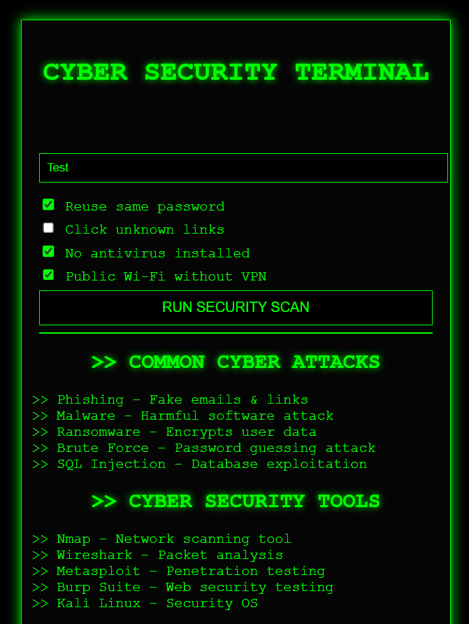
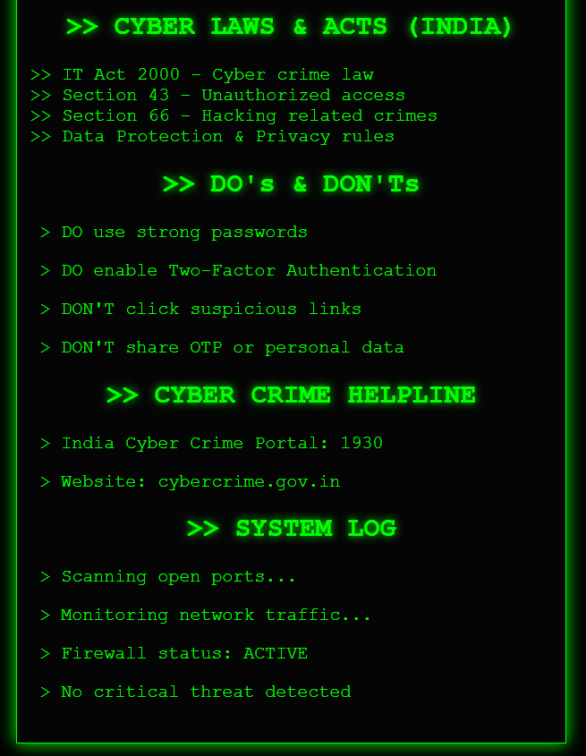
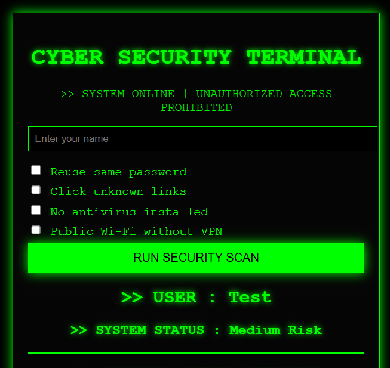

# 🔐 Cyber Security Awareness & Risk Analysis System

A professional academic web application developed using **Python and Flask**, designed to spread **cyber security awareness** and perform **basic cyber risk analysis** through a hacker-style terminal interface.

---

## 📌 Project Overview

The **Cyber Security Awareness & Risk Analysis System** analyzes a user’s cyber security habits through a simple questionnaire and categorizes the risk level as:

- 🟢 Low Risk  
- 🟡 Medium Risk  
- 🔴 High Risk  

Along with risk analysis, the system educates users about **common cyber attacks**, **cyber security tools**, **cyber laws in India**, and **best practices** to stay safe online.

This project is suitable for **academic submission**, **portfolio showcase**, and **cyber security awareness programs**.

---

## 🖥️ Project Screenshots

<p align="center">
  
  
  
</p>

<p align="center">
  <b>Home</b> &nbsp;&nbsp;&nbsp;
  <b>Awareness & Info</b> &nbsp;&nbsp;&nbsp;
  <b>Risk Result</b>
</p>

---

## 🚀 Key Features

- Cyber risk analysis (Low / Medium / High)
- Awareness of common cyber attacks:
  - Phishing
  - Malware
  - Ransomware
  - Brute Force Attacks
  - SQL Injection
- Information about cyber security tools:
  - Nmap
  - Wireshark
  - Metasploit
  - Burp Suite
  - Kali Linux
- Cyber laws & acts (India)
- Cyber safety Do’s and Don’ts
- Hacker-style terminal themed user interface
- Beginner-friendly academic project

---

## 🛠️ Technologies Used

- Python  
- Flask  
- HTML  
- CSS  

---

## 🌐 Domain

Cyber Security

---

## ▶️ How to Run the Project

1. Install Python (3.x recommended)  
2. Install Flask:
   ```bash
   pip install flask
3. Run the application:
   python app.py
4. Open your browser and visit:
   http://127.0.0.1:5000

## 📂 Project Structure

    CyberSecurityAwarenessProject
│
├── app.py
├── README.md
├── result.txt
├── templates/
│   └── index.html
├── static/
│   └── style.css
└── screenshots/
    ├── home.png
    ├── info.png
    └── result.png

    
## 🎓 Academic Use

This project is developed strictly for educational and academic purposes to demonstrate cyber security awareness and basic risk analysis concepts.

## 👤 Author

-- Vishwa Surati

## ⭐ Future Enhancements

 -- User authentication system
 -- Database integration
 -- Advanced risk scoring
 -- Cloud deployment

## 📌 Conclusion
The Cyber Security Awareness & Risk Analysis System helps users understand cyber threats, evaluate their security practices, and learn how to stay safe in the digital world through an interactive and engaging interface.


 
   


   
